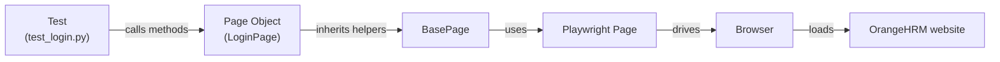

# OrangeHRM Test Automation

A hands-on, 4-week training project for learning **UI test automation** with
**Python + Playwright** using the **Page Object Model (POM)** design pattern.

The application under test is **OrangeHRM**, a free, stable open-source HR demo:
<https://opensource-demo.orangehrmlive.com/>
&nbsp;&nbsp;•&nbsp;&nbsp;Login: **`Admin`** / **`admin123`**

---

## Table of Contents

1. [What You Will Learn](#-what-you-will-learn)
2. [Tech Stack](#-tech-stack)
3. [Prerequisites](#-prerequisites)
4. [Getting Started](#-getting-started)
5. [Project Structure](#-project-structure)
6. [How It Works: The Page Object Model](#-how-it-works-the-page-object-model)
7. [Running the Tests](#-running-the-tests)
8. [The 4-Week Plan](#-the-4-week-plan)
9. [How to Make Them Learn](#-how-to-make-them-learn)
10. [Evaluation Rubric](#-evaluation-rubric)
11. [Learning Resources](#-learning-resources)

---

## What You Will Learn

- Python fundamentals applied to a real project (classes, modules, fixtures).
- Browser automation with **Playwright** (locators, auto-waiting, assertions).
- Writing tests with **pytest** (fixtures, markers, parametrization).
- The **Page Object Model** — how to structure a maintainable test suite.
- Test design: positive/negative cases, data-driven tests, independent tests.
- Working with a real Angular app: custom dropdowns, label-based inputs, and
  waiting for AJAX-loaded tables instead of using brittle sleeps.
- Debugging tests with the **Playwright Trace Viewer** and code generator.
- Reporting, parallel & cross-browser execution.
- Professional workflow: **Git** branches, pull requests, and **CI/CD**.

---

## Tech Stack

| Tool | Purpose |
|------|---------|
| [Python 3.10+](https://www.python.org/) | Programming language |
| [Playwright](https://playwright.dev/python/) | Browser automation engine |
| [pytest](https://docs.pytest.org/) | Test runner & framework |
| [pytest-playwright](https://playwright.dev/python/docs/test-runners) | Connects Playwright to pytest (`page` fixture) |
| [Faker](https://faker.readthedocs.io/) | Generates realistic random test data |
| [pytest-html](https://pytest-html.readthedocs.io/) | HTML test reports |
| [pytest-xdist](https://pytest-xdist.readthedocs.io/) | Parallel test execution |

---

## Prerequisites

Install these once before starting:

- **Python 3.10 or newer** — check with `python --version`.
- **Git** — check with `git --version`.
- **VS Code** (recommended) with the **Python** and **Playwright Test** extensions.

---

## Getting Started

> Commands below use **Windows PowerShell**. On macOS/Linux the only difference
> is how you activate the virtual environment (noted inline).

```powershell
# 1. Create and activate a virtual environment (keeps dependencies isolated)
python -m venv .venv
.\.venv\Scripts\Activate.ps1        # macOS/Linux:  source .venv/bin/activate

# 2. Install the Python dependencies
pip install -r requirements.txt

# 3. Install the Playwright browsers (Chromium, Firefox, WebKit)
playwright install

# 4. Create your local configuration file
Copy-Item .env.example .env         # macOS/Linux:  cp .env.example .env

# 5. Run the example tests to confirm everything works
#    (--headed shows the browser so you can watch the very first run)
pytest tests/test_login.py --headed
```

If the login tests pass, your environment is ready.

---

## Project Structure

```
project/
├── README.md               ← you are here
├── requirements.txt        ← Python dependencies
├── pytest.ini              ← pytest configuration & markers
├── conftest.py             ← shared fixtures (browser setup, logged-in session, ...)
├── .env.example            ← template for local settings (copy to .env)
│
├── config/
│   └── config.py           ← single source of truth for URL, credentials, timeouts
│
├── pages/                  ← THE PAGE OBJECTS (one class per page)
│   ├── base_page.py        ← shared parent class + OrangeHRM helpers
│   │                          (fill_by_label, select_dropdown_by_label,
│   │                           wait_for_loading_done, ...)
│   ├── login_page.py                  ← login + error handling        (example)
│   ├── dashboard_page.py              ← To implement
│   ├── pim_employee_list_page.py      ← To implement
│   ├── pim_add_employee_page.py       ← To implement
│   ├── admin_user_page.py             ← To implement
│   └── recruitment_add_candidate_page.py       ← To implement
│
├── tests/                  ← THE TESTS (one file per feature)
│   ├── test_login.py              ←fully implemented example
│   ├── test_dashboard.py         ← To implement
│   ├── test_employee_list.py       ← To implement
│   ├── test_add_employee.py        ← To implement
│   ├── test_admin_user_search.py     ← To implement
│   └── test_add_candidate.py       ← To implement
│
└── utils/
    └── data_generator.py   ← Faker-based random employee/candidate generator
```


---

## How It Works: The Page Object Model

The Page Object Model keeps **"how to find/click things" (page objects)**
separate from **"what we are testing" (tests)**. This makes tests readable and
means a UI change only needs a fix in *one* place.



**Golden rules**

- A **page object** contains *locators* and *actions* only. **No assertions.**
- A **test** contains *assertions* and reads like a user story. **No raw selectors.**
- Locators live as constants at the top of each page object, so they are easy to find and update.

Compare a test *with* POM vs *without*:

```python
# Without POM — fragile and hard to read
page.goto("https://opensource-demo.orangehrmlive.com/web/index.php/auth/login")
page.locator('input[name="username"]').fill("Admin")
page.locator('input[name="password"]').fill("admin123")
page.locator('button[type="submit"]').click()
page.wait_for_url("**/dashboard/index")

# With POM — clear intent, reusable, maintainable
login_page = LoginPage(page)
login_page.login("Admin", "admin123")
assert login_page.login_succeeded()
```

### OrangeHRM is an Angular app — two helpers you'll use a lot

OrangeHRM is built with a custom component library (`oxd-*` classes), so two
patterns come up again and again. They live in `base_page.py` so every page can
reuse them:

- **`fill_by_label("Email", value)`** — many inputs have no stable `name`
  attribute, so we find them by their visible label text.
- **`select_dropdown_by_label("User Role", "Admin")`** — OrangeHRM dropdowns are
  *not* native `<select>` elements; you click the control, then click an option.
- **`wait_for_loading_done()`** — after a search/filter, OrangeHRM reloads the
  table via AJAX and shows a spinner. Waiting for that spinner to disappear is
  far more reliable than a fixed `sleep`.

---

## Running the Tests

```powershell
# Run the whole suite
pytest

# Run one file or one test
pytest tests/test_login.py
pytest tests/test_login.py::test_login_with_valid_credentials

# Run by marker (see pytest.ini for the full list)
pytest -m smoke                  # only the quick critical-path tests
pytest -m "login or dashboard"   # combine markers
pytest -m pim                    # all PIM-module tests

# Watch the browser while tests run (great for learning & debugging).
# By default tests run headless (no window); add --headed to see them.
pytest --headed
pytest --headed --slowmo 1000    # also slow each action down by 1 second

# Cross-browser
pytest --browser firefox
pytest --browser webkit

# Run in parallel across CPU cores
pytest -n auto

# Open the HTML report afterwards (created at reports/report.html)
Invoke-Item reports/report.html
```

**Debugging helpers (learn these early — they save hours):**

```powershell
# Step through a test in the Playwright Inspector
$env:PWDEBUG=1; pytest tests/test_login.py; Remove-Item Env:PWDEBUG

# Record actions and auto-generate Playwright code
playwright codegen https://opensource-demo.orangehrmlive.com/

# A trace is saved on failure (see pytest.ini). View it with:
playwright show-trace reports/test-artifacts/<trace-folder>/trace.zip
```

---

## The 4-Week Plan

> Each week has a **theme**, **topics to learn**, **hands-on tasks**, and a
> **deliverable** demoed at the end of the week. Tasks build on each other:
> the project is fully scaffolded in Week 1 and the intern writes more and more
> of it themselves each week.

### Week 1 — Foundations & First Tests

**Theme:** Understand the tools and the application; get everything running.

| Topics to learn | Hands-on tasks |
|---|---|
| What is test automation & why it matters | Install Python, VS Code, Git, dependencies, browsers |
| Python refresher: classes, imports, virtual envs | Run all the example tests; make them pass |
| Playwright basics: `page`, locators, actions | Log into OrangeHRM manually; explore PIM, Admin, Recruitment |
| Locator strategies (CSS, text, attributes) | Read `login_page.py` and `test_login.py` line by line |
| Intro to pytest (test discovery, running) | Use `playwright codegen` to record a login |
| What the Page Object Model is and why | Write a tiny new test: assert the login page title is shown |
| Git basics: clone, branch, commit, push | Create a feature branch and push your first commit |

**Deliverable (end of Week 1):**
- Environment fully working; all example tests pass locally.
- A short self-written test committed on a Git branch.
- Intern can explain, in their own words, what a page object is.

---

### Week 2 — Locators, Assertions & Data-Driven Tests 🔍

**Theme:** Go deep on the example features (login, dashboard, employee list) and
master the core skills by *extending* them.

| Topics to learn | Hands-on tasks |
|---|---|
| Playwright auto-waiting & web-first assertions (`expect`) | Add 3+ new login cases (wrong user, only-username, spaces, ...) |
| Negative testing & validating messages | Assert the exact "Invalid credentials" / "Required" texts |
| `pytest.mark.parametrize` (data-driven tests) | Turn several invalid-login cases into one parametrized test |
| Fixtures: what they are, the ones in `conftest.py` | Use `standard_user`, `dashboard`, `new_employee`, `new_candidate` |
| Generating test data with Faker | Read `data_generator.py`; add a field if useful |
| Navigation & global components | Add tests that navigate to Leave, Time, My Info via the side menu |
| Reading existing code & refactoring | Code review: explain the example page objects to the mentor |

**Deliverable (end of Week 2):**
- At least 6 new, meaningful login/navigation test cases (positive + negative).
- One parametrized test demonstrating data-driven testing.
- All tests green; clean commits with good messages.

---

### Week 3 — Implement the HR Features (the core work)

**Theme:** Independently implement the page objects + tests left as skeletons.
This is where the intern proves they can apply the pattern on their own.

| Feature to implement | Page object | Test file |
|---|---|---|
| PIM → Add Employee | `pages/pim_add_employee_page.py` | `tests/test_add_employee.py` |
| Admin → User Search | `pages/admin_user_page.py` | `tests/test_admin_user_search.py` |
| Recruitment → Add Candidate | `pages/recruitment_add_candidate_page.py` | `tests/test_add_candidate.py` |

**Topics to learn:** filling forms, OrangeHRM custom dropdowns
(`select_dropdown_by_label`), label-based inputs (`fill_by_label`), reading data
from tables, waiting for AJAX results (`wait_for_loading_done`), composing
several page objects into one end-to-end scenario, and debugging with the Trace
Viewer.

**Tasks:**
1. Implement each `TODO` method in the three page objects (follow the worked
   examples in `login_page.py` and `pim_employee_list_page.py`).
2. Complete each skeleton test and **remove its `@pytest.mark.skip`**.
3. Write one **end-to-end** test that ties features together, e.g.:
   *add a new employee → search the Employee List by the new Id → assert it appears.*
   (The Add Employee skeleton already points you toward this.)
4. **Stretch goals** (if ahead of schedule): add page objects + tests for
   **My Info** (update personal details), **Directory** (search employees), or
   **Admin → Add User**.

**Deliverable (end of Week 3):**
- All skeleton page objects and tests implemented; no skipped tests.
- At least one end-to-end scenario passing.
- Full suite green locally.

---

### Week 4 — Quality, Reporting

**Theme:** Turn the suite into something that looks and runs like a real
project at a company.

| Topics to learn | Hands-on tasks |
|---|---|
| HTML reports & screenshots/video/trace on failure | Generate and review `reports/report.html` |
| Smoke vs regression suites (markers) | Curate a fast `-m smoke` suite (< 1 min) |
| Parallel execution (`pytest-xdist`) | Run the suite with `-n auto`; fix any flakiness |
| Cross-browser testing | Run across `chromium`, `firefox`, `webkit` |
| Handling flaky tests (`pytest-rerunfailures`) | Use `--reruns 1` and discuss *why* flakiness happens |
| CI/CD concepts + GitHub Actions | Write a workflow that runs tests on every push |
| Code quality (formatting, linting) | Format the code; clean up TODOs and dead code |

**Tasks:**
1. Create a `.github/workflows/tests.yml` that installs deps, installs
   browsers, runs `pytest -m smoke`, and uploads the HTML report as an artifact ( if we have time )
2. Make the CI run pass on the `main` branch ( if we have time )
3. Write a short section in this README documenting *your* additions.

**Deliverable (end of Week 4):**
- Green CI pipeline running automatically on push.
- Reports produced as CI artifacts.
- **Final demo & presentation** (15 min): walk through the architecture, run a
  live test, show the CI pipeline, and share lessons learned.


## Learning Resources

- **Playwright for Python:** <https://playwright.dev/python/docs/intro>
- **Playwright Locators:** <https://playwright.dev/python/docs/locators>
- **Playwright Assertions:** <https://playwright.dev/python/docs/test-assertions>
- **Trace Viewer:** <https://playwright.dev/python/docs/trace-viewer>
- **pytest docs:** <https://docs.pytest.org/>
- **pytest fixtures:** <https://docs.pytest.org/en/stable/how-to/fixtures.html>
- **Faker:** <https://faker.readthedocs.io/>
- **OrangeHRM demo site:** <https://opensource-demo.orangehrmlive.com/>
- **Page Object Model (Playwright):** <https://playwright.dev/python/docs/pom>

---

keep it green
